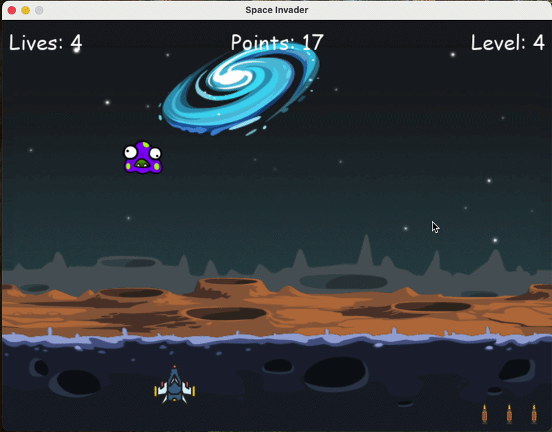
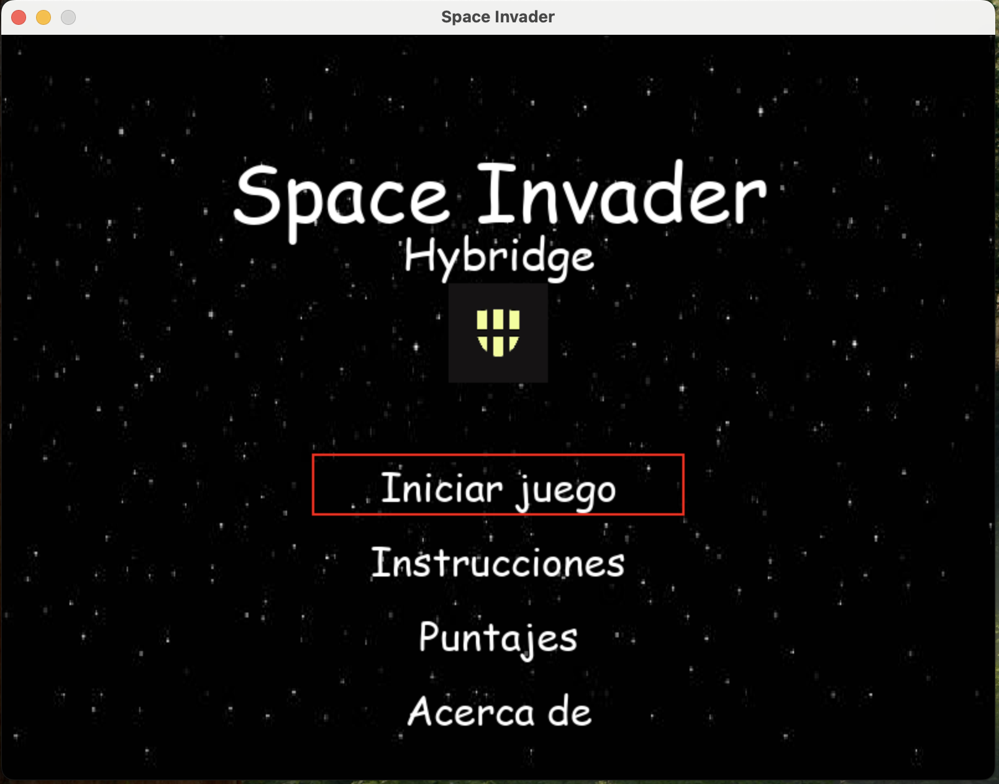
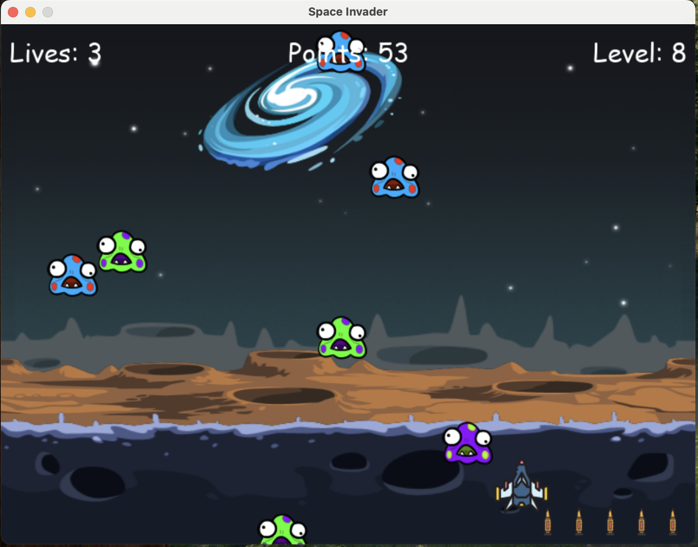
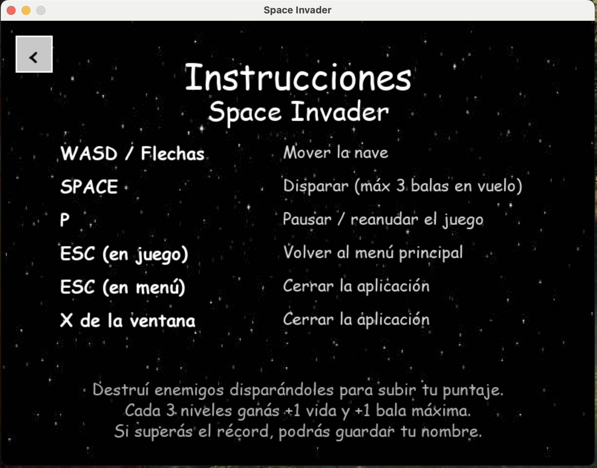
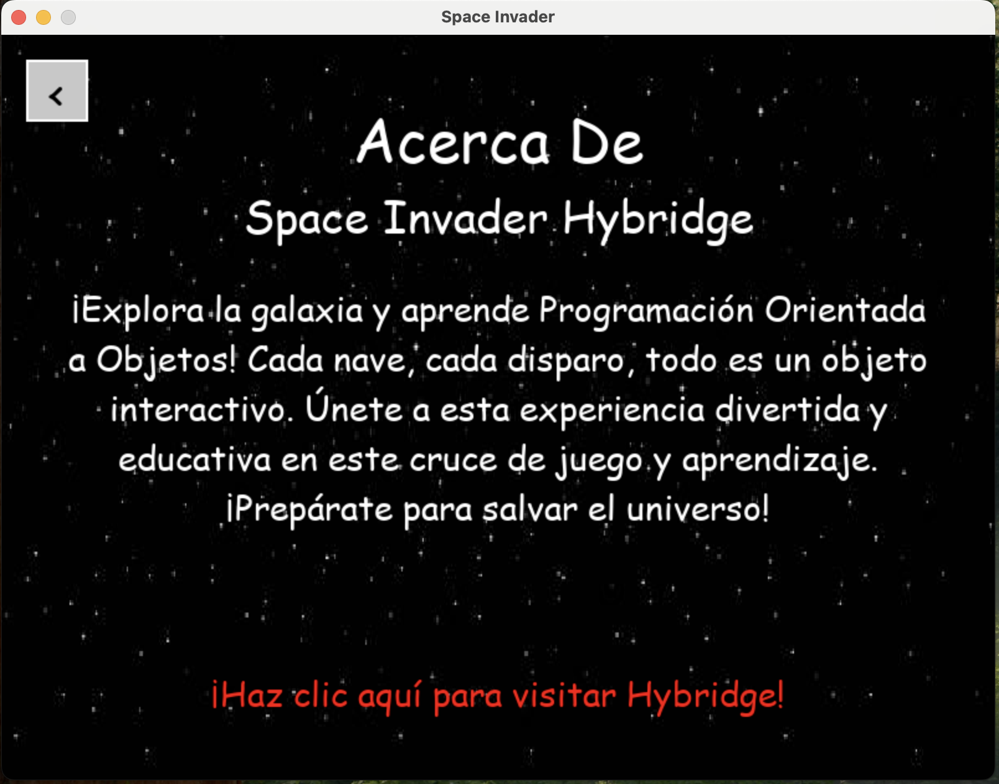
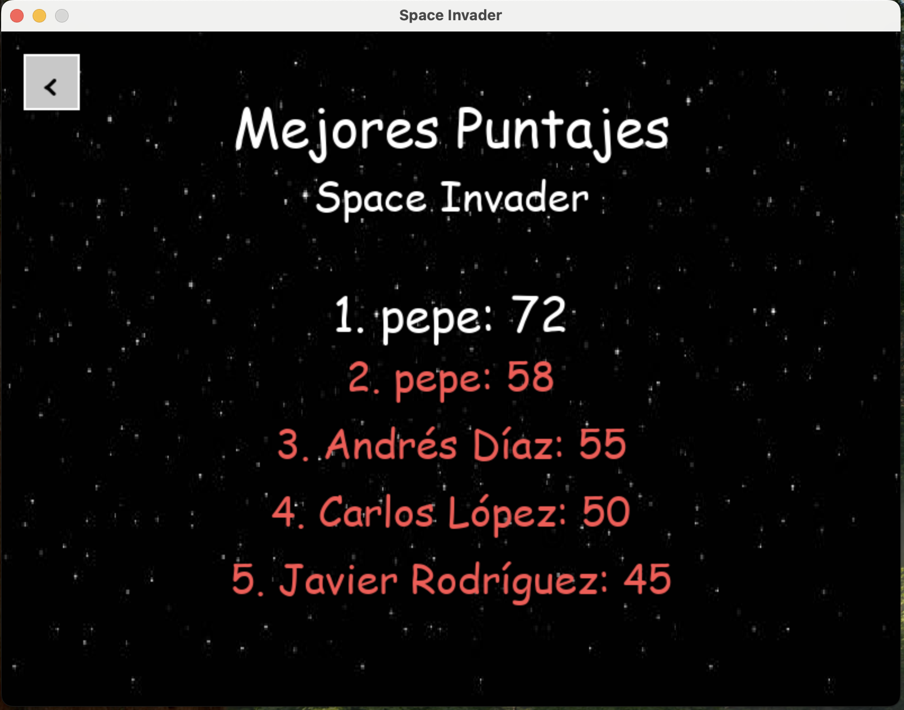
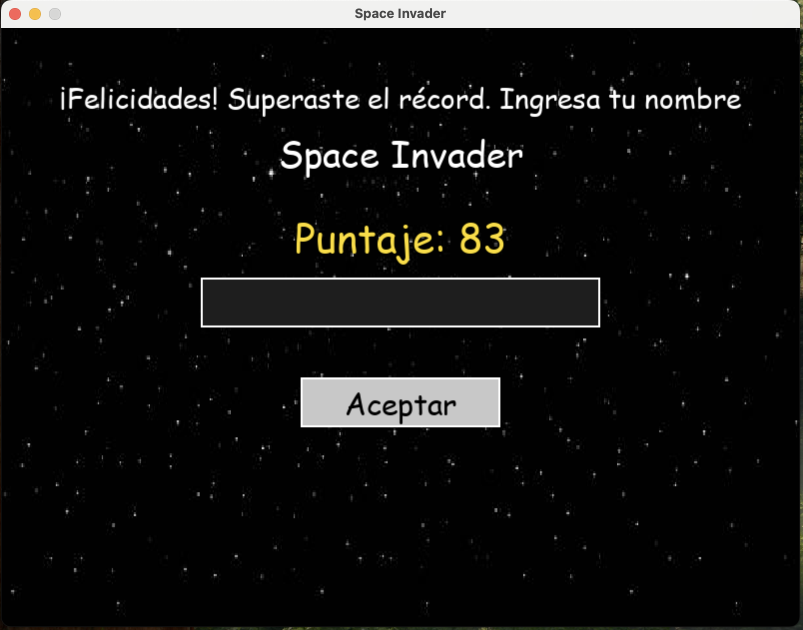
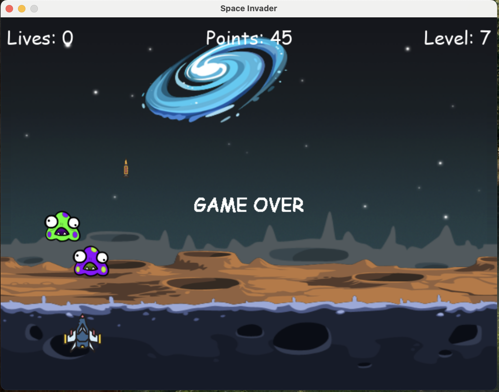

# 👾 Space Invader Hybridge

[](https://www.python.org/downloads/)
[](https://pyga.me/)
[](LICENSE)
[](https://github.com/jose2501106-IA/space-invader/actions/workflows/ci.yml)
[](tests/)
[](https://docs.astral.sh/ruff/)



> Clon completo de **Space Invaders** en Python + pygame-ce. Construido en 14 fases iterativas con **Claude Code**, integra menú principal, sistema de récords persistente, pausa, navegación completa entre 5 pantallas y arquitectura orientada a objetos con 11 clases.

## 🎮 Demo

### Menú principal


### Gameplay


### Instrucciones


### Acerca De


### Top de Puntajes


### Batir el récord


### Game Over


## ✨ Características

- **3 tipos de enemigos** (azul, verde y púrpura) con escalado de dificultad
  por nivel (×1.1 por nivel) y oleadas que crecen 1 enemigo por nivel.
- **Sistema de puntaje persistente**: `puntajes.txt` en la raíz del repo
  guarda nombre y score; el juego lee el top 5 y destaca el récord histórico.
- **5 pantallas** además del juego: menú principal, instrucciones, puntajes,
  acerca de + pantalla de input al batir récord.
- **Audio integrado**: música de fondo en loop, efecto de explosión al matar
  un enemigo y fanfarria de victoria al batir el récord histórico.
- **Cooldowns de disparo** (máx 3 balas en vuelo) y **recompensas cada 3
  niveles**: +1 vida (cap 6) y +1 bala máxima (cap 10).
- **Pausa con `P`** en pleno juego, con overlay semi-transparente y música
  pausada hasta retomar.
- **Navegación 100% por teclado** en gameplay; los menús aceptan teclado y
  mouse indistintamente.

## 🎯 Controles

> Todos los controles también están disponibles en la pantalla
> **Instrucciones** del menú principal.

- **Mover**: `WASD` o flechas (`↑ ← ↓ →`).
- **Disparar**: `SPACE` (máx 3 balas en vuelo, con cooldown).
- **Pausar / reanudar**: `P` (durante el juego).
- **Volver al menú**: `ESC` (sale al menú principal sin cerrar la app).
- **Cerrar app**: `ESC` en el menú principal o cerrar la ventana.

## 🛠️ Requisitos

- **Python 3.10 o superior** (probado en 3.14).
- **[pygame-ce](https://pyga.me/) 2.5.7** — fork comunitario de pygame, drop-in
  compatible. Se usa esta variante porque es la única con wheels para Python
  3.14 al momento de este proyecto. El código sigue siendo `import pygame`,
  solo cambia el nombre del paquete en `pip install`.
- **macOS, Linux o Windows** — sin requerimientos de hardware especial.
  Resolución fija 800×600 a 60 FPS.

## 🚀 Cómo correr el juego

```bash
git clone <este-repo>
cd space-invader

python -m venv .venv
source .venv/bin/activate          # macOS / Linux
# .venv\Scripts\activate           # Windows

pip install -r requirements.txt
python main.py
```

El juego abre directamente en el menú principal. Elegí "Iniciar juego" con
las flechas y Enter.

## 📁 Estructura del proyecto

```
space-invader/
├── ShipClass.py              # Clase base de naves
├── BulletClass.py            # Bullet con mask pixel-perfect
├── EnemyClass.py             # Enemy(Ship) — 3 colores, oleadas escaladas
├── PlayerClass.py            # Player(Ship) — movimiento, disparo, hit()
├── GameClass.py              # HUD, lives/level, lectura de récords
├── DrawingClass.py           # Pipeline de render del juego
├── PantallaNombreClass.py    # Input al batir récord
├── MenuPrincipalClass.py     # Menú principal (entry point)
├── MenuInstruccionesClass.py # Pantalla de instrucciones
├── MenuPuntajesClass.py      # Top 5 de récords
├── MenuAcercaDeClass.py      # Acerca de + link a Hybridge
├── main.py                   # Entry point + flujos de navegación
├── img/                      # Sprites + fondos + logo Hybridge + ícono
├── sounds/                   # background_song.mp3, explosion.wav, ganar.mp3
├── puntajes.txt              # Récords persistentes (nombre,score por línea)
├── docs/                     # Documentación de referencia del curso
├── requirements.txt
├── LICENSE
├── README.md
└── CLAUDE.md                 # Brief del proyecto para Claude Code
```

## 🏗️ Arquitectura

Diseño orientado a objetos con jerarquía simple: `Ship` es la clase base de
naves y de ella heredan `Player` y `Enemy`. La lógica de juego está separada
en clases puras (`Game` para HUD/estado, `Drawing` para pipeline de render,
`Bullet` con detección de colisión por mask pixel-perfect) que no tocan
flujo de aplicación. La capa de UI vive en 5 clases independientes —
`MenuPrincipal`, `MenuInstrucciones`, `MenuPuntajes`, `MenuAcercaDe` y
`PantallaNombre` — todas con el mismo patrón: reciben la ventana por
constructor, tienen `@classmethod load_assets()` lazy, y exponen un método
público (`mostrar()` o `ejecutar()`) con su propio while loop. La navegación
entre pantallas usa **callbacks pasados por constructor** (`back_mtd`,
`init_*_mtd`), lo que evita singletons y deja que el call stack unwinde
naturalmente cuando el usuario navega de vuelta.

## 🤖 Construido con Claude Code

Este proyecto fue construido íntegramente usando **Claude Code** (la CLI de programación de Anthropic) en 14 fases iterativas, siguiendo una metodología disciplinada de:

1. **Planning antes de codear**: cada fase arranca con un brief detallado de entregables, validación y commits propuestos. Ningún código se escribe sin un plan claro.
2. **Validación a dos capas por fase**:
   - **Smoke test headless** automatizado (`SDL_VIDEODRIVER=dummy`) que detecta tracebacks y errores de import sin abrir ventana.
   - **Verificación sintética** con `assert`s específicos sobre estado interno: tamaños de Surface, valores de atributos, output de funciones puras.
   - **Validación visual humana**: el desarrollador prueba manualmente cada fase antes de aprobar el commit, atrapando bugs que ningún test automático puede ver (como un logo solapando un título).
3. **Commits granulares**: 14 commits, uno por fase, con mensajes descriptivos. Permite revertir o auditar cualquier paso del proceso.
4. **Documentación de bugs detectados**: cada `# FIX:` en el código documenta un bug del material original o un edge case descubierto durante implementación. La tabla de "Bugs corregidos" más abajo viene 100% de esos comentarios.

📖 Leé la metodología completa en [docs/METHODOLOGY.md](docs/METHODOLOGY.md).

### Las 14 fases del proyecto

| # | Fase | Tipo |
|---|------|------|
| 0 | Setup inicial (venv, requirements, estructura, assets, .gitignore) | Base |
| 1 | `Ship` + `Game` + ventana abre con HUD funcional | Base |
| 2 | `Bullet` + `Enemy` (3 colores, oleadas aleatorias) | Base |
| 3 | `Player` (movimiento WASD/flechas, disparo, cooldowns) | Base |
| 4 | `Drawing` encapsula el render pipeline | Base |
| 5 | Colisiones, sistema de niveles, GAME OVER, música, README inicial | Base |
| 6 | Setup de assets nuevos (sounds/, puntajes.txt, menú imgs) + bonus gameplay | Expansión |
| 7 | Sistema de puntaje (Points HUD, lectura de récords, sonidos kill/win) | Expansión |
| 8 | `PantallaNombre` para input al batir récord (con hardening de newline) | Expansión |
| 9 | `MenuPuntajes` (top 5 leído de archivo) | Expansión |
| 10 | `MenuAcercaDe` con link clickeable a Hybridge | Expansión |
| 11 | `MenuPrincipal` como entry point + flujo completo de navegación | Expansión |
| 12 | Pantalla de pausa con tecla P | Polish |
| 13 | `MenuInstrucciones` con todos los controles del juego | Polish |

### Métricas del proceso

- **15 commits en `main`**, 14 de ellos por fase + 1 de documentación, todos con validación previa.
- **12 bugs del material original** detectados y corregidos (ver tabla más abajo).
- **4 bugs descubiertos durante el proceso** (no presentes en el material):
  1. El conflicto entre la tecla `K_a` (atajo Acerca de) y WASD (movimiento del player), detectado antes del primer commit de Fase 10.
  2. La fusión de líneas en `puntajes.txt` por falta de newline final, detectada al revisar el `git diff` antes del commit de Fase 8.
  3. El solapamiento del logo Hybridge sobre el título del menú principal, detectado en validación visual de Fase 11.
  4. El solapamiento de la columna de teclas sobre la columna de descripciones en `MenuInstrucciones`, detectado en validación visual de Fase 13.
- **0 bugs llegaron a producción**: todos fueron atrapados antes del commit gracias al ciclo plan → implementar → smoke + sintética → validación visual → commit.

## 🐛 Bugs corregidos del material original

Durante la implementación se encontraron y corrigieron los siguientes bugs
del material del curso. Cada corrección está marcada con `# FIX:` en el
código.

| # | Archivo | Bug original | Corrección |
|---|---------|--------------|------------|
| 1 | `EnemyClass.py` | Typo `spped` en `__init__` | Renombrado a `speed` |
| 2 | `EnemyClass.py` / `PlayerClass.py` | `WIDTH`/`HEIGHT` como globales | Pasados como parámetros `screen_width`/`screen_height` |
| 3 | `PlayerClass.py` | Paréntesis mal cerrados en `move()` | Reagrupados correctamente |
| 4 | `PlayerClass.py` | `hit()` retornaba en la primera iteración | Recorre todas las balas, remueve solo la que impacta |
| 5 | `ShipClass.py` | `bullets` / `fired_bullets` como variables de clase | Movidos a atributos de instancia (evita listas compartidas) |
| 6 | `GameClass.py` | Typo `HEIGTH` mezclado con `HEIGHT` | Siempre `HEIGHT` |
| 7 | `GameClass.py` | `Game.over()` con `==` (carrera de frames) y mini-loop bloqueante mezclado | Refactor: `over()` no bloquea, `show_game_over_screen()` aparte |
| 8 | `GameClass.py` (Fase 7) | Spec asumía formato `nombre,puntuación`; archivo real usa `nombre, puntuación` con espacio | `rsplit(',', 1)` + `.strip()` en cada parte |
| 9 | `main.py` (Fase 1) | `Game.escape()` consumía eventos por su cuenta (doble `event.get()` race) | Recibe la lista `events` desde el caller |
| 10 | `PantallaNombreClass.py` (Fase 8 hardening) | Append-write sin verificar newline final corrompía la última línea | Lee el último byte y prepende `\n` si falta |
| 11 | `PantallaNombreClass.py` | Spec original abría con check de existencia + `'w'` o `'a'` | Modo `'a'` único cubre crear/append en una sola llamada |
| 12 | `main.py` (Fase 11) | ESC mezclado con QUIT en `Game.escape()` impedía volver al menú sin cerrar app | Detección inline separada para QUIT (cierra) y ESC (vuelve al menú) |

## 📦 Dependencias y créditos

- **Motor**: [pygame-ce 2.5.7](https://pyga.me/) — fork comunitario de pygame.
- **Sprites y música**: material original del curso de **Hybridge Education**.
- **Implementación**: desarrollada con **Claude Code** en 13 fases iterativas
  (6 fases base de gameplay + 6 fases de expansión con menús y persistencia +
  1 fase de polish con pausa).

## 📜 Licencia

Distribuido bajo licencia **MIT**. Ver [LICENSE](LICENSE) para más detalles.

## 🎓 Sobre este proyecto

Este es un proyecto educativo de **Programación Orientada a Objetos en
Python** construido como parte de un curso de **Hybridge Education**. El
objetivo fue partir de un material de referencia y construir, fase por fase,
una aplicación completa con arquitectura limpia y persistencia de datos.

Forks, issues y pull requests son bienvenidos.


## 🙏 Acknowledgments

- **Hybridge Education** — por el material base y la comunidad estudiantil
- **Anthropic** — por Claude Code, el copiloto de desarrollo
- **pygame-ce community** — por mantener el fork con wheels Python 3.14
